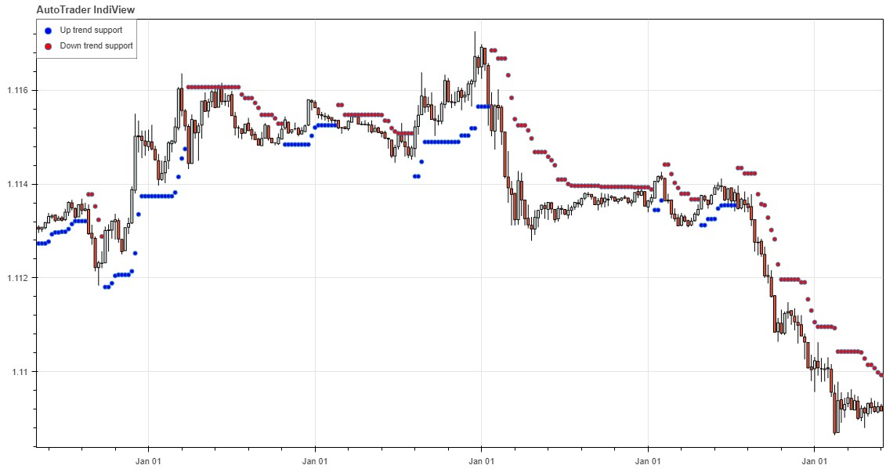
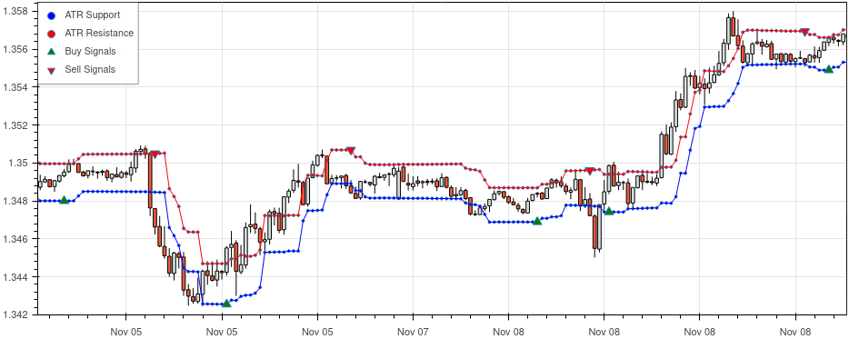
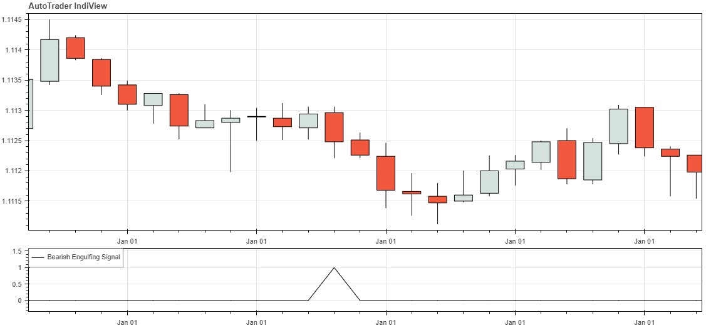
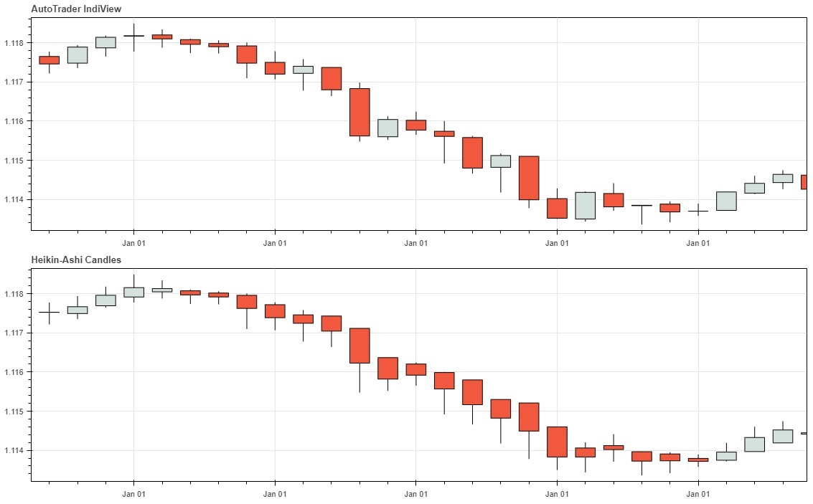
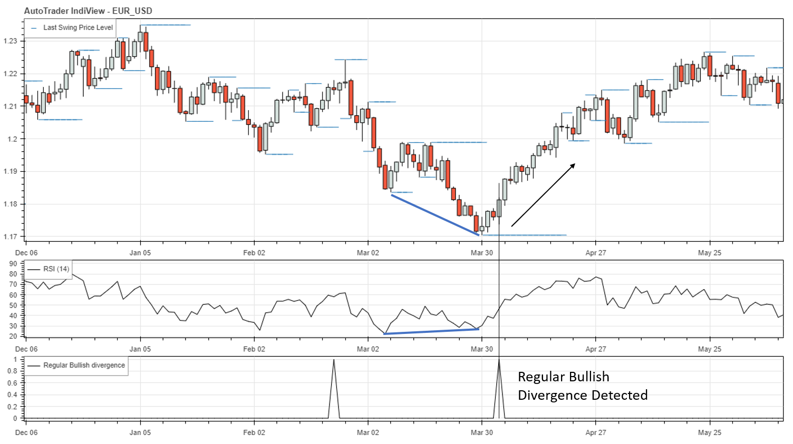
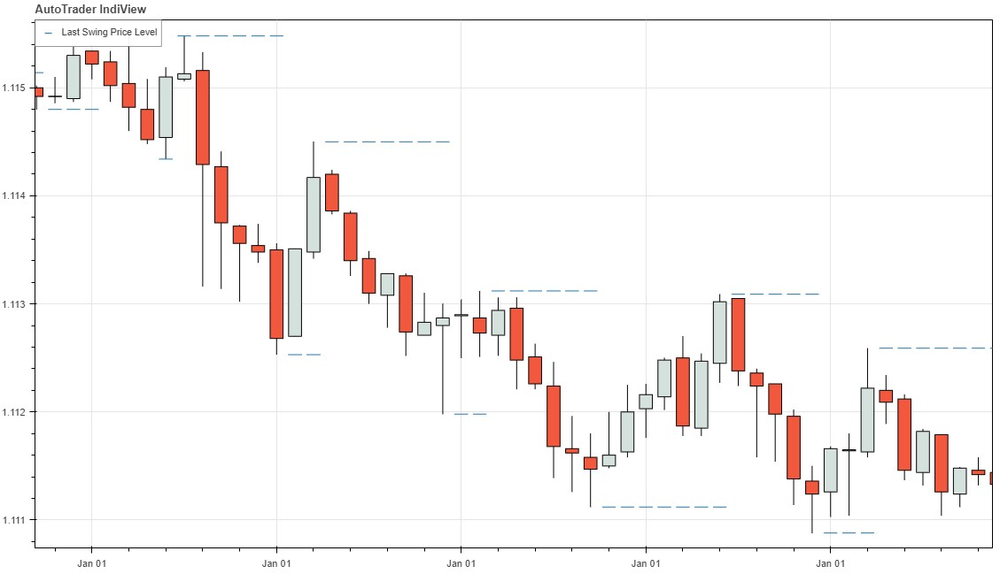
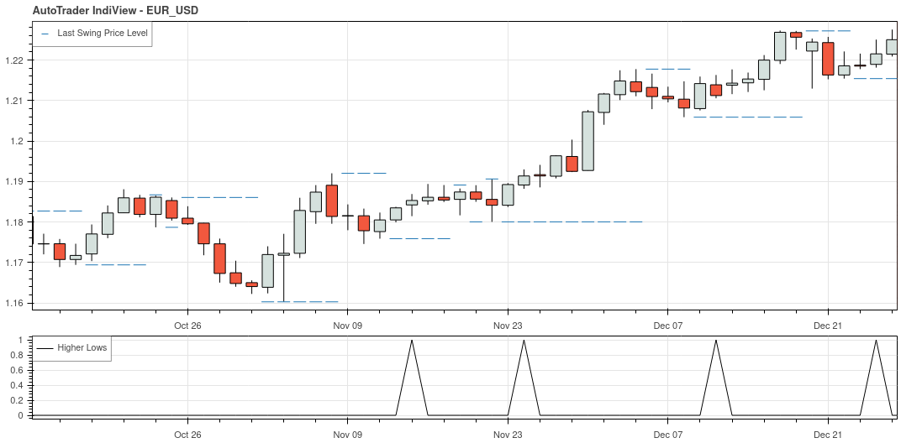
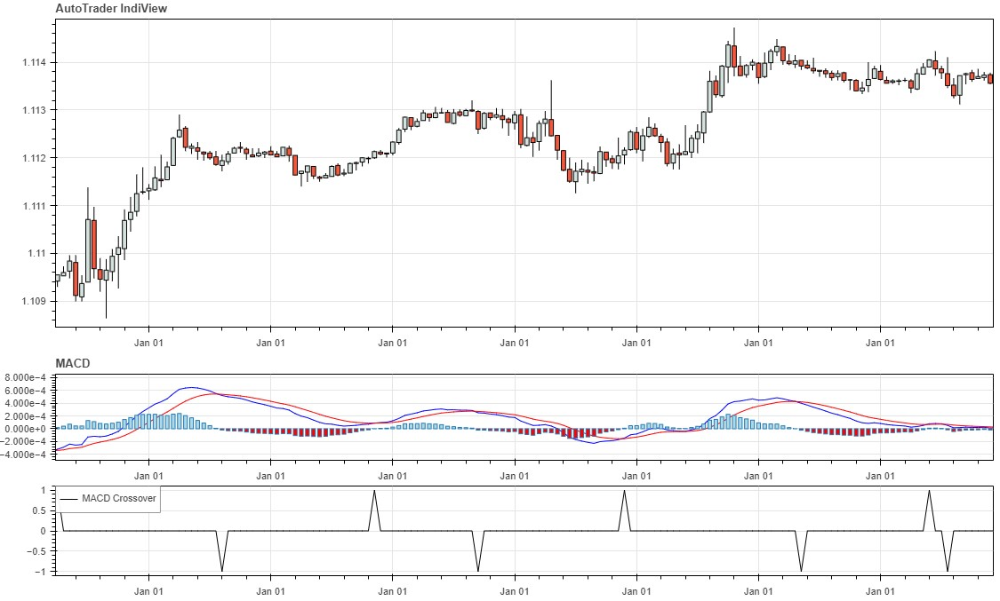

(indicator-library)=
# AutoTrader Custom Indicators


This page showcases the indicators available in AutoTraders' indicator library. All images shown here were created with 
[AutoPlot](core/AutoPlot), using the `view_indicators` function. This function can be called using the code snipped provided 
below, where `indicator_dict` is constructed for the indicator being plotted. This dictionary is shown for each indicator 
below. Note that the [indicators dictionary](strategy-indicator-dict) passed to the `view_indicators` method must
be formatted according to the correct [specification](autoplot-indi-spec).

```python
from autotrader import indicators
from autotrader.autoplot import AutoPlot

indicator_dict = {}

ap = autoplot.AutoPlot()
ap.data = data
ap.view_indicators(indicator_dict)
```

For each indicator below, the function definition is provided, along with a sample code snippet of
how to plot the indicator with [AutoPlot](core/AutoPlot).

## Indicators

(indi-supertrend)=
### Supertrend Indicator

```{eval-rst}
.. autofunction:: autotrader.indicators.supertrend
```


```python
st_df = indicators.supertrend(data, ATR_multiplier=2)

indicator_dict = {'Supertrend': {'type': 'Supertrend',
                                  'data': st_df}
                  }
```

Note that the supertrend dataframe also contains a trend column, indicating the current trend.

|   Column    | Description |
|:-----------:|-------------|
|uptrend| Uptrend price support level|
|downtrend| Downtrend price support level|
|trend| Current trend (1 for uptrend, -1 for downtrend)|




(indi-halftrend)=
### HalfTrend Indicator
The HalfTrend indicator is based on the 
[indicator by *everget*](https://www.tradingview.com/script/U1SJ8ubc-HalfTrend/) on
TradingView.

```{eval-rst}
.. autofunction:: autotrader.indicators.halftrend
```


```py
halftrend_df = indicators.halftrend(data)
indicator_dict = {'HalfTrend': {'type': 'HalfTrend',
                                'data': halftrend_df}}
```




(indi-bearish-engulfing)=
### Bearish Engulfing Pattern
Returns a list with values of `1` when the bearish engulfing pattern appears and a value of `0` elsewhere.


```{eval-rst}
.. autofunction:: autotrader.indicators.bearish_engulfing
```

```py
engulfing_bearish = indicators.bearish_engulfing(data, detection = None)
indicator_dict = {'Bearish Engulfing Signal': {'type': 'Engulfing',
                                      'data': engulfing_bearish}
                  }
```




(indi-bullish-engulfing)=
### Bullish Engulfing Pattern
Returns a list with values of `1` when the bullish engulfing pattern appears and a value of `0` elsewhere.

```{eval-rst}
.. autofunction:: autotrader.indicators.bullish_engulfing
```


```py
engulfing_bullish = indicators.bullish_engulfing(data, detection = None)
indicator_dict = {'Bullish Engulfing Signal': {'type': 'Engulfing',
                                      'data': engulfing_bullish}
                  }
```


(heikin-ashi)=
### Heikin-Ashi Candlesticks
Returns a dataframe of [Heikin-Ashi](https://www.investopedia.com/trading/heikin-ashi-better-candlestick/) candlesticks.


```{eval-rst}
.. autofunction:: autotrader.indicators.heikin_ashi
```

```py
ha_data = indicators.heikin_ashi(OHLC_data)

indicator_dict = {'Heikin-Ashi Candles': {'type': 'Heikin-Ashi',
                                          'data': ha_data}
                  }
```

Note that a copy of the data must be passed into the `heikin-ashi` function by using the `.copy()` function, to prevent 
overwriting the original `data`. See [here](https://pandas.pydata.org/pandas-docs/stable/reference/api/pandas.DataFrame.copy.html) 
for more information.




(divergence)=
### Divergence
The `autodetect_divergence` indicator can be used to detect divergence between price movements and and an indicator.

```{eval-rst}
.. autofunction:: autotrader.indicators.autodetect_divergence
```


```py
rsi_divergence = indicators.autodetect_divergence(data, rsi)

indicator_dict = {'RSI (14)': {'type': 'RSI',
                               'data': rsi},
                  'Bullish divergence': {'type': 'below',
                                         'data': rsi_divergence['regularBull']},
                  }
```

Below is an example of this indicator, as detailed in the 
[Detecting Divergence](https://kieran-mackle.github.io/AutoTrader/2021/11/08/detecting-divergence.html) blog post. 
Note that this indicator
is actually a wrapper for other indicators, to make detecting divergence even simpler.




```{admonition} See Also
[`find_swings`](swing-detection), [`classify_swings`](classifying-swings) and [`detect_divergence`](detecting-divergence)
```


## Utility Indicators
The following is a collection of utility indicators which assist in building effective strategies.

(swing-detection)=
### Swing Detection
A common challenge of algo-trading is the ability to accurately pick recent swings in price to use as stop loss levels.
This indicator attempts to solve that problem by locating the recent swings in price. This indicator returns a dataframe 
with three columns: Highs, Lows and Last, described below. 

```{eval-rst}
.. autofunction:: autotrader.indicators.find_swings
```


|   Column    | Description |
|:-----------:|-------------|
| Highs       | Most recent swing high |
| Lows        | Most recent swing low  |
| Last        | Most recent swing      |


```py
swings         = indicators.find_swings(data)
indicator_dict = {'Swing Detection': {'type': 'Swings',
                                      'data': swings}
                  }
```

To detect swings, an exponential moving average is fitted to the inputted data. The slope of this line is then used 
determine when a swing has been formed. Naturally, this is a lagging indicator. The lag can be controlled by the 
input parameter `n`, which corresponds to the period of the EMA.



This indicator was used in the MACD strategy developed in the 
[tutorials](../tutorials/building-strategy) to set stop-losses.


(classifying-swings)=
### Classifying Swings
The `classify_swings` indicator may be used to detect 'higher highs' and 'lower lows'. This indicator of course 
also detects 'lower highs' and 'higher lows'. It relies upon the output of the `find_swings` indicator.
It returns a dataframe with the following columns appended to the swing dataframe.

| Column Name | Description | Values |
| ----------- | ----------- | ------ |
| `HH` | Higher High | `True` or `False` |
| `HL` | Higher Low | `True` or `False` |
| `LL` | Lower Low | `True` or `False` |
| `LH` | Lower High | `True` or `False` |


```{eval-rst}
.. autofunction:: autotrader.indicators.classify_swings
```


```py
price_swings = indicators.find_swings(price_data)
price_swings_classified = indicators.classify_swings(price_swings)

indicator_dict = {'Price Swings': {'type': 'Swings',
                                   'data': price_swings},
                  'Higher Lows': {'type': 'below',
                                  'data': price_swings_classified['HL']},
                  }
```

The plot below gives an example of this indicator detecting higher lows in price.




```{admonition} See Also
[`find_swings`](swing-detection)
```

(detecting-divergence)=
### Detecting Divergence
To detect divergence between price and an indicator, the `detect_divergence` indicator may be used. This indicator
relies on both `find_swings` and `classify_swings`. It detects regular and hidden divergence.


```{eval-rst}
.. autofunction:: autotrader.indicators.detect_divergence
```


The example below shows the indicator detecting regular bullish divergence in price using the RSI as the indicator.


```{admonition} See Also
[`find_swings`](swing-detection), [`classify_swings`](classifying-swings) and 
[`autodetect_divergence`](divergence)
```


(crossover-indi)=
### Crossover
Returns a list with values of `1` when input `list_1` crosses **above** input `list_2`, values of `-1` when input 
`list_1` crosses **below** input `list_2`, and values of `0` elsewhere.

```{eval-rst}
.. autofunction:: autotrader.indicators.crossover
```


The example below illustrates the functionality of this indicator with the 
[MACD indicator](https://www.investopedia.com/terms/m/macd.asp). Note that the MACD line is passed into 
`indicators.crossover` as `list_1`, and the MACD signal line as `list_2`. This ensures that a value of `1` will
correspond to points when the MACD line crosses above the signal line, and a value of `-1` when it crosses
below the signal line.

```py
macd, macd_signal, macd_hist = ta.MACD(data.Close.values)
macd_crossover = indicators.crossover(macd, macd_signal)

indicator_dict = {'MACD': {'type': 'MACD',
                           'macd': macd,
                           'signal': macd_signal,
                           'histogram': macd_hist},
                  'MACD Crossover': {'type': 'Crossover',
                                     'data': macd_crossover}
                  }
```




(cross-value)=
### Cross Value
Returns the value at which a crossover occurs using linear interpolation. Requires three inputs: two lists and a third
list corresponding to the points in time which the two lists crossover. Consider the example described below.

```{eval-rst}
.. autofunction:: autotrader.indicators.cross_values
```


The example provided below builds upon the example described for the [crossover](crossover-indi) indicator. Again, the MACD
indicator is used, and MACD/signal line crossovers are found using `indicators.crossover`. The specific values at which 
this crossover occurs can then be calculated using `indicators.cross_values(macd, macd_signal, macd_crossover)`. This will
return a list containing the values (in MACD y-axis units) where the crossover occured. This is shown in the image below,
labelled 'Last Crossover Value'. This indicator is useful in strategies where a crossover must occur above or below a 
specified threshold.

```py
macd, macd_signal, macd_hist = ta.MACD(data.Close.values)
macd_crossover = indicators.crossover(macd, macd_signal)
macd_covals = indicators.cross_values(macd, macd_signal, macd_crossover)

indicator_dict = {'MACD': {'type': 'MACD',
                           'macd': macd,
                           'signal': macd_signal,
                           'histogram': macd_hist,
                           'crossvals': macd_covals},
                  'MACD Crossover': {'type': 'Crossover',
                                     'data': macd_crossover}
                  }
```


(candles-between-crosses)=
### Candles Between Crosses
Returns a list with a count of how many candles have passed since the last crossover (that is, how many elements in
a list since the last non-zero value).

```{eval-rst}
.. autofunction:: autotrader.indicators.candles_between_crosses
```


The example provided below demonstrates this indicator with EMA crossovers. 

```py
ema10           = ta.EMA(data.Close.values, 10)
ema20           = ta.EMA(data.Close.values, 20)
ema_crossovers  = indicators.crossover(ema10, ema20)
ema_crosscount = indicators.candles_between_crosses(ema_crossovers)

indicator_dict = {'EMA (10)': {'type': 'MA',
                               'data': ema10},
                  'EMA (20)': {'type': 'MA',
                               'data': ema20},
                  'EMA Crossover': {'type': 'Crossover',
                                     'data': ema_crossovers},
                  'Candles since EMA crossover': {'type': 'Crosscount',
                                                  'data': ema_crosscount}
                  }
```


(heikin-ashi-run)=
### Heikin-Ashi Candlestick Run
```{eval-rst}
.. autofunction:: autotrader.indicators.ha_candle_run
```

This indicator returns two lists; one each for the number of consecutive green and red Heikin-Ashi candles. Since
Heikin-Ashi trends usually last for approximately 5-8 candles, it is useful to know how many consecutive red or
green candles there have been so far, to avoid getting into a trend too late. This indicator allows you to prevent
that by telling you how many candles into a trend the price action is.


(merge-signals)=
### Merge signals
Returns a single signal list which has merged two signal lists. 

```{eval-rst}
.. autofunction:: autotrader.indicators.merge_signals
```


(rolling-signal)=
### Rolling Signal

Returns a list which maintains the previous signal, until a new 
signal is given.

```{eval-rst}
.. autofunction:: autotrader.indicators.rolling_signal_list
```


(unroll-signals)=
### Unroll Signal List

Performs the reverse function of [`rolling`](rolling-signal).

```{eval-rst}
.. autofunction:: autotrader.indicators.unroll_signal_list
```
