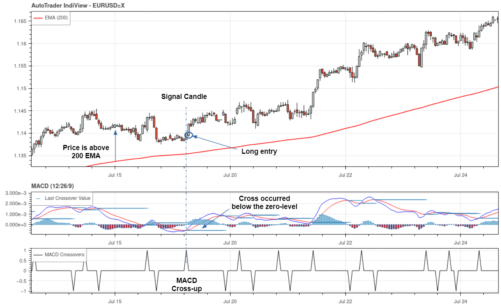

(detailed-walkthrough)=
# Detailed AutoTrader Walkthrough

A popular MACD crossover strategy will be developed in this section. An important note 
here is that this strategy assumes that the trading instrument can be short-sold. 

```{warning}
This walkthrough is intentionally very thorough and detailed. If you don't mind g
lossing over the finer details, or are comfortable programming in Python, the 
[condensed walkthrough](condensed-walkthrough) might be better suited to you.
```

(walthrough-strat-rules)=
## Strategy Rules
The rules for the MACD strategy are defined as follows.

1. Trade in the direction of the trend, as determined by the 200-period exponential 
moving average (EMA) (if the current price above 200EMA, there is an up-trend and only
long trades should be made, and if price is below, there is a down-trend and only short
trades should be made).
2. Enter a long position when the MACD line crosses *up* over the signal line, and enter short when the MACD line crosses *down* below the signal line.
3. To ensure only the strongest signals, the MACD crossover must occur below the 
histogram zero line for long positions, and above the histogram zero line for short 
positions.
3. Stop losses are set at recent price swings/significant price levels. We will use 
AutoTrader's [swing detection](swing-detection) indicator for this.
4. Take profit levels are set at 1:1.5 risk-to-reward, meaning that winning trades make
1.5 times more than losing trades lose.


(walkthrough-strategy-parameters)=
### Strategy Parameters
From these rules, the following strategy parameters can be defined:

| Parameter | Nominal value |
|-----------|---------------|
| ema_period | 200 |
| MACD_fast | 12  |
| MACD_slow | 26  |
| MACD_smoothing | 9 |
| RR | 1.5 |

An example of a long entry signal from this strategy is shown in the image below 
(generated using [AutoTrader IndiView](../features/visualisation)).




```{toctree}
:maxdepth: 2
:hidden:

Building a Strategy <building-strategy>
Getting Price Data <getting-data>
Backtesting <backtesting>
Live Trading <going-live>
```